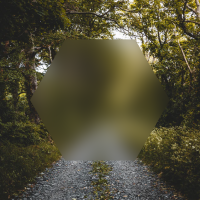

# Pixie - A full-featured 2D graphics library for Nim

⚠️ WARNING: This library is still in heavy development. ⚠️

Pixie is a 2D graphics library similar to [Cairo](https://www.cairographics.org/) and [Skia](https://skia.org) written (almost) entirely in Nim.

This library is being actively developed and is not yet ready for use. Since you've managed to stumble onto it, give it a star and check back soon!

`nimble install pixie`

Features:
* Drawing paths, shapes and curves, with even-odd and non-zero windings.
* Strokes with joins and caps.
* Shadows, glows and blurs.
* Complex masking: Subtract, Intersect, Exclude.
* Complex blends: Darken, Multiply, Color Dodge, Hue, Luminosity... etc.
* Pixel perfect AA quality.
* Supported file formats: PNG, BMP, JPG, SVG + more in development.

## Testing

`nimble test`

## Examples

### Square
[examples/square.nim](examples/square.nim)
```nim
var p: Path
p.rect(50, 50, 100, 100)

image.fillPath(p, rgba(255, 0, 0, 255))
```


### Rounded rectangle
[examples/rounded_rectangle.nim](examples/rounded_rectangle.nim)
```nim
let
  x = 50.0
  y = 50.0
  w = 100.0
  h = 100.0
  r = 25.0

var path: Path
path.roundedRect(vec2(x, y), vec2(w, h), r, r, r, r)

image.fillPath(path, rgba(0, 255, 0, 255))
```


### Heart
[examples/heart.nim](examples/heart.nim)
```nim
image.fillPath(
  """
    M 20 60
    A 40 40 90 0 1 100 60
    A 40 40 90 0 1 180 60
    Q 180 120 100 180
    Q 20 120 20 60
    z
  """,
  parseHtmlColor("#FC427B").rgba
)
```


### Shadow
[examples/shadow.nim](examples/shadow.nim)
```nim
var p: Path
p.polygon(100, 100, 70, sides=8)
p.closePath()

var polyImage = newImage(200, 200)
polyImage.fillPath(p, rgba(255, 255, 255, 255))

image.draw(polyImage.shadow(
  offset = vec2(2, 2),
  spread = 2,
  blur = 10,
  color = rgba(0, 0, 0, 200)
))
image.draw(polyImage)
```


### Blur
[examples/blur.nim](examples/blur.nim)
```nim
var p: Path
p.polygon(100, 100, 70, sides=6)
p.closePath()

let mask = newMask(200, 200)
mask.fillPath(p)

blur.blur(20)
blur.draw(mask, blendMode = bmMask)

image.draw(trees)
image.draw(blur)
```


### Tiger
[examples/tiger.nim](examples/tiger.nim)
```nim
let tiger = readImage("examples/data/tiger.svg")

image.draw(
  tiger,
  translate(vec2(100, 100)) *
  scale(vec2(0.2, 0.2)) *
  translate(vec2(-450, -450))
)
```

